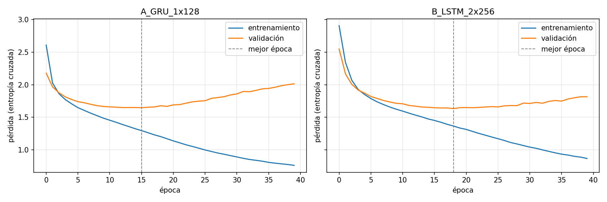

# Evidencias del generador de nombres

| Archivo | Contenido |
| --- | --- |
| `configuraciones.csv` | Arquitectura, capas, estado oculto, épocas, pérdida, optimizador y métricas de las dos configuraciones |
| `curvas_perdida.png` | Curvas de pérdida de entrenamiento y validación |
| `historial_perdidas.json` | Valores de pérdida por época |
| `muestreo.csv` | Estrategias de muestreo (temperatura, top-k, top-p) con % nuevos, % únicos y ejemplos |
| `nombres_generados.json` | Los diez nombres nuevos y el elegido |
| `registro_modelo.txt` | Nombre y versión del modelo de Ollama (paso 2, SageMaker) |
| `<nombre>.png` + `identidad_<nombre>.json` | Imagen e identidad del dinosaurio elegido (pasos 2 y 3) |

Datos: 1536 nombres de `dinos.csv`, 90 % entrenamiento y 10 % validación. Vocabulario de letras a–z más `<PAD>`, `<SOS>` y `<EOS>`.

## 1. Configuraciones evaluadas

| Configuración | Celda | Capas | Estado oculto | Embedding | Dropout | Épocas | Optimizador (lr) | Pérdida | Parámetros | Mejor pérdida de validación (época) |
| --- | --- | --- | --- | --- | --- | --- | --- | --- | --- | --- |
| A_GRU_1x128 | GRU | 1 | 128 | 32 | 0.0 | 40 | Adam (0.003) | CrossEntropy, ignora `<PAD>` | 66 877 | 1.647 (16) |
| B_LSTM_2x256 | LSTM | 2 | 256 | 64 | 0.3 | 40 | Adam (0.001) | CrossEntropy, ignora `<PAD>` | 865 373 | **1.633 (19)** |

**Análisis.** En ambas configuraciones la pérdida de entrenamiento baja durante las 40 épocas, pero la de validación deja de mejorar a mitad del entrenamiento y luego sube: es sobreajuste, esperable con solo 1536 nombres. La GRU sin dropout sobreajusta antes y con más fuerza: su validación toca el mínimo en la época 16 (1.647) y termina en 2.014. La LSTM de dos capas con dropout 0.3 tarda más en sobreajustar (mínimo en la época 19, 1.633) y termina en 1.815, porque el dropout la regulariza.

Se eligió la configuración B por tener la menor pérdida de validación. La diferencia con A es pequeña (0.014) a pesar de que B tiene 13 veces más parámetros: con un dataset tan corto, el límite lo pone la cantidad de datos más que el tamaño del modelo. Para ambos modelos se guardaron los pesos de la mejor época de validación, no los de la última.

## 2. Estrategias de muestreo (100 nombres por estrategia)

| Estrategia | % nuevos | % únicos | Longitud media | Observación |
| --- | --- | --- | --- | --- |
| T = 0.5 | 93 | 98 | 11.9 | Nombres muy convencionales, casi todos terminan en *-osaurus* |
| T = 1.0 | 100 | 100 | 12.0 | Más variedad, algunos con errores (*stonecasauus*) |
| T = 1.5 | 100 | 100 | 12.3 | Pierde los patrones de nombre de dinosaurio (*neconge*, *yonmadris*) |
| top-k = 3 | 92 | 88 | 11.6 | Repetitivo: muchos nombres se generan dos veces |
| top-k = 10 | 97 | 100 | 11.9 | Buen equilibrio |
| top-p = 0.5 | 88 | 87 | 12.4 | La más conservadora: menos nombres nuevos y más repetidos |
| top-p = 0.9 | 97 | 100 | 12.0 | Buen equilibrio |
| **T = 0.8 + top-p = 0.9** | 93 | 99 | 11.9 | **Elegida**: nombres creíbles y casi sin repeticiones |

**Análisis.** La temperatura controla el compromiso entre parecido y novedad: con 0.5 el modelo repite los patrones más frecuentes del dataset y con 1.5 inventa combinaciones que ya no suenan a dinosaurio. Top-k y top-p recortan los caracteres improbables; con valores estrictos (k = 3, p = 0.5) se comportan como una temperatura baja y bajan la diversidad (87–88 % de únicos). Se eligió temperatura 0.8 con top-p 0.9 porque produce nombres pronunciables con raíces reales y conserva 99 % de nombres únicos.

## 3. Diez nombres generados

Ninguno está en `dinos.csv` (comprobado en el notebook).

1. Sinornithomerus
2. Aptosaurus
3. Gomposaurus
4. Brintodon
5. Corachornis
6. Steroponyx
7. Menosaurus
8. Sinocephale
9. Sinornis
10. Stradosaurus

**Análisis.** El modelo aprendió raíces reales y las combina de forma nueva: *sino-* (China), *ornitho-* (ave), *-cephale* (cabeza), *-odon* (diente) y *-onyx* (garra). Algunos nombres quedan muy cerca de géneros reales: *Aptosaurus* recuerda a *Apatosaurus*, y *Sinornis* existe como género de ave fósil aunque no aparece en el dataset. Ambos cumplen la regla de no copiar el conjunto de entrenamiento, pero por eso no se eligieron.

**Dinosaurio elegido: Sinornithomerus** («muslo de ave de China»), porque combina tres raíces con significado y da pistas claras para construir su identidad en el paso siguiente.
